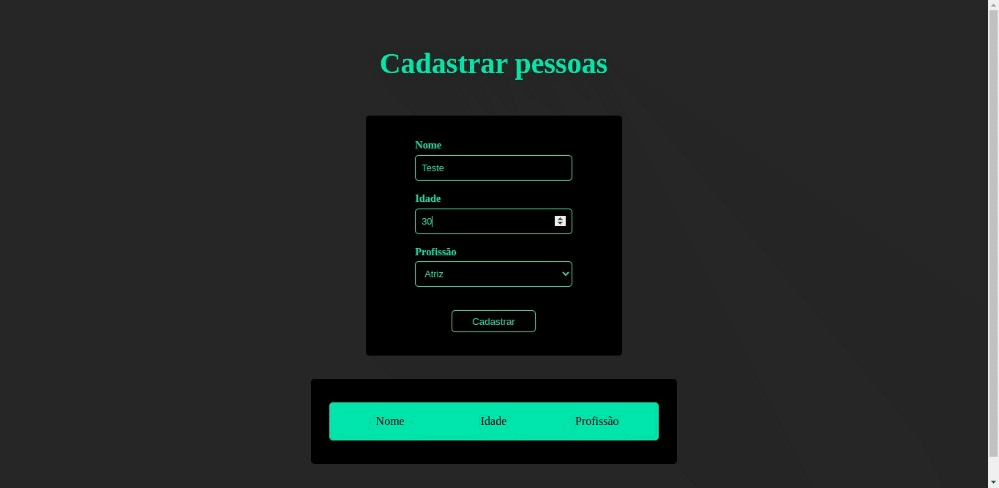

# Desafio 2 - Refatoração de código para TypeScript

 
Enunciado: refatorar o código JS abaixo para que não apresente erros utilizando Typescript.

``` javascript
let pessoa1 = {};
pessoa1.nome = "maria";
pessoa1.idade = 29;
pessoa1.profissao = "atriz"

let pessoa2 = {}
pessoa2.nome = "roberto";
pessoa2.idade = 19;
pessoa2.profissao = "Padeiro";

let pessoa3 = {
    nome: "laura",
    idade: "32",
    profissao: "Atriz"
};

let pessoa4 = {
    nome = "carlos",
    idade = 19,
    profissao = "padeiro"
}
```

Feateres do desafio executado:

* Elaboração de uma interface para criação de um "pessoa", onde a profissão é um enum para padronizar.
``` typescript
enum OccupationEnum {
    Atriz, 
    Padeiro
}

interface IPerson {
    age: number,
    name: string
    occupation: OccupationEnum
}
```
* Elaboração de um método para criar uma nova pessoa.
```typescript
const createNewPerson = () : IPerson => {

    const selectedOption:string = selectOccupation.options[selectOccupation.selectedIndex].value

    const newPerson: IPerson = {
        name: inputName.value,
        age: Number(inputAge.value),
        occupation: selectedOption === "Atriz" ? OccupationEnum.Atriz : OccupationEnum.Padeiro
    }


    return newPerson;
}
```
* Elaboração de um método para criar um novo item HTML na lista de pessoas.
```typescript
const addNewPersonToList = () => {

    const person: IPerson = createNewPerson();

    const newItem = `<li class="person-item">
                        <span>
                            ${person.name}
                        </span>
                        <span>
                            ${person.age}
                        </span>
                        <span>
                            ${OccupationEnum[person.occupation]}
                        </span>
                    </li>`
    
    personsList.innerHTML += newItem;
}
```
* Elaboração de uma interface responsiva para uma melhor visualização do desafio.



