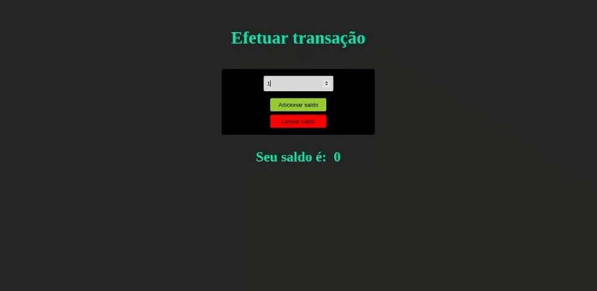

# Desafio 3 - Refatoração de código para TypeScript

 
Enunciado: refatorar o código JS abaixo para que não apresente erros utilizando Typescript.

``` javascript
let botaoAtualizar = document.getElementById('atualizar-saldo');
let botaoLimpar = document.getElementById('limpar-saldo');
let soma = document.getElementById('soma');
let campoSaldo = document.getElementById('campo-saldo');

campoSaldo.innerHTML = 0

function somarAoSaldo(soma) {
    campoSaldo.innerHTML += soma;
}

function limparSaldo() {
    campoSaldo.innerHTML = '';
}

botaoAtualizar.addEventListener('click', function () {
    somarAoSaldo(soma.value);
});

botaoLimpar.addEventListener('click', function () {
    limparSaldo();
});
```
```HTML
<h4>Valor a ser adicionado: <input id="soma"> </h4>
<button id="atualizar-saldo">Atualizar saldo</button>
<button id="limpar-saldo">Limpar seu saldo</button>
<h1>"Seu saldo é: " <span id="campo-saldo"></span></h1>
```

Feateres do desafio executado:

* Refatoração das funções utilizando arrow functions e typescript
``` typescript
const sumBalance = (value: number) => {    
    result.innerHTML = (Number(result.innerHTML) + value).toString();
}

const clearBalance = () => {
    result.innerHTML = '0';
}

const inputSumNotIsEmpty = (input:string) => input.length > 0 ? true : false;

const inputValue = (input:string) => inputSumNotIsEmpty(input) ? Number(input) : 0;

btnSum.addEventListener('click', () => {
    sumBalance(inputValue(inputSum.value))
});

btnClear.addEventListener('click', () => clearBalance())

```
* Elaboração de uma interface responsiva para uma melhor visualização do desafio.



